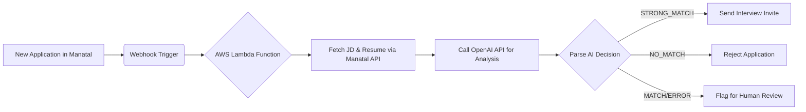

# 🤖 AI Recruiter: Manatal Auto-Shortlist

**Tired of manually sifting through hundreds of resumes?** This project automates the initial candidate screening process by leveraging the power of Large Language Models (LLMs) directly within your Manatal ATS.

Every time a new application arrives, an AI agent springs into action. It analyzes the resume against the job description, scores the candidate, and automatically triggers the next step—whether it's sending an interview invite or a polite rejection. Ambiguous cases are flagged for human review, ensuring you never miss a great candidate.

> **Goal:** To supercharge recruitment efficiency, reduce time-to-hire, and allow human recruiters to focus on what they do best: building relationships.

---

## 🚀 How It Works

### The Magic Behind the Curtain

1.  **Event Trigger:** A new application is submitted in Manatal.
2.  **Data Fetch:** Our system pulls the candidate's resume and the corresponding job description via the Manatal API.
3.  **AI Analysis:** The core LLM (OpenAI's GPT model) acts as an expert recruiter. It evaluates the application based on key criteria like skills, experience, and education.
4.  **Decision & Action:** The AI returns a structured decision (`STRONG_MATCH`, `MATCH`, `NO_MATCH`). The system then performs the appropriate action in Manatal via its API:
    *   `STRONG_MATCH` → Candidate is moved to "Interview" stage and an invite is sent.
    *   `NO_MATCH` → Candidate is politely rejected.
    *   `MATCH` → Application is tagged for "Human Review" (the safety net!).

### High-Level Architecture


---

## 🛠️ Tech Stack

*   **Language:** Python 3
*   **LLM API:** OpenAI GPT-4-turbo / GPT-3.5-turbo
*   **Cloud Runtime:** AWS Lambda (Serverless)
*   **Orchestration:** AWS EventBridge (Rule-based triggering)
*   **API Client:** `requests` for Manatal & OpenAI APIs
*   **Secrets Management:** AWS Secrets Manager
*   **Version Control:** GitHub

---

## 📋 Core Features

*   **Automated Screening:** Instantly evaluates candidates 24/7.
*   **Structured & Fair Decisions:** Uses a consistent, pre-defined prompt to minimize bias and ensure every candidate is judged by the same criteria.
*   **Human-in-the-Loop:** Safely flags edge cases for expert review.
*   **Seamless Integration:** Directly integrates with Manatal's API to read data and trigger actions.
*   **Transparent Logging:** Every AI decision and action is logged within Manatal for full auditability.

---

## 🔮 Getting Started

### Prerequisites

1.  A Manatal account with access to its API.
2.  An OpenAI API key.
3.  An AWS account (for deployment).

### Installation & Setup

*(This is a high-level overview. See the [Wiki](https://github.com/weldon-kenei/ATS-Workdlow-Automation/wiki) for detailed setup instructions.)*

1.  **Clone the repo:**
    ```bash
    git clone https://github.com/weldon-kenei/ATS-Workdlow-Automation.git
    cd manatal-ai-shortlist
    ```

2.  **Configure environment variables:**
    Set your `MANATAL_API_KEY`, `OPENAI_API_KEY`, and other configs in AWS Secrets Manager.

3.  **Deploy the function:**
    The infrastructure is defined as code (e.g., using AWS SAM or Serverless Framework). Deploy with:
    ```bash
    sam build
    sam deploy --guided
    ```

4.  **Configure Webhook in Manatal:**
    Point a Manatal webhook for new applications to your deployed Lambda function URL.

---

## 📂 Project Structure

```
├── src/
│   └── lambda_function.py  # Main Lambda handler logic
├── prompts/
│   └── evaluation_prompt.md  # The core LLM prompt
├── tests/
│   └── test_lambda.py      # Unit tests
├── template.yaml           # AWS SAM template for infrastructure
└── README.md
```

---

## 🤝 Contributing & Collaboration

We believe in building transparent and fair AI tools. Contributions, ideas, and discussions are welcome! Please feel free to fork this repo, open an issue, or submit a pull request.

1.  Fork the Project
2.  Create your Feature Branch (`git checkout -b feature/AmazingFeature`)
3.  Commit your Changes (`git commit -m 'Add some AmazingFeature'`)
4.  Push to the Branch (`git push origin feature/AmazingFeature`)
5.  Open a Pull Request

---

## ⚠️ Important Notes on Ethics & Bias

*   **This is a screening aid, not a replacement.** The final hiring decision must always involve a human.
*   LLMs can reflect and amplify biases present in their training data. We mitigate this through careful prompt design, consistent criteria, and a mandatory human review for middle-ground cases.
*   We recommend regularly auditing the AI's decisions against human outcomes to check for any unintended bias or drift.

---

## 📄 License

This project is licensed under the MIT License - see the [LICENSE.md](LICENSE.md) file for details.

---

## 🙋‍♂️ Need Help?

Have a question or want to collaborate?
*   Open an [issue](https://github.com/weldon-kenei/ATS-Workdlow-Automation/issues) on GitHub.
*   Connect with me on LinkedIn: [Weldon Kenei](https://www.linkedin.com/in/weldon-kenei)

---
**Built with ❤️ and ☕ by Weldon Kenei**
